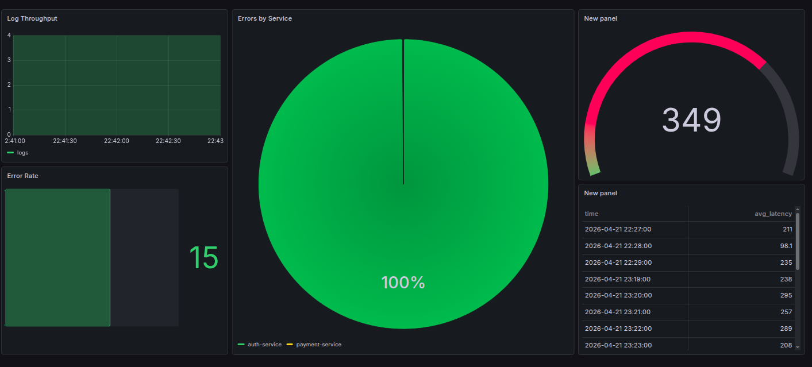

# KloudMate

KloudMate is a small observability-style pipeline demo:

- A Go **producer** publishes JSON log events to **Kafka**
- A Go **backend** consumes those events, writes them to **ClickHouse**, tracks error counts in **Redis**, and triggers a simple alert action when errors spike
- **Grafana** is included (via Docker Compose) to visualize data from ClickHouse

## Screenshot



## Architecture (high level)

1. `producer` → Kafka topic `logs`
2. `backend` Kafka consumer (`group-1`) reads `logs`
3. `backend`:
   - inserts rows into ClickHouse table `logs`
   - increments Redis key `error_count:<service>` for `ERROR` logs (TTL 60s)
   - prints an alert if error count exceeds 20 within the TTL window

## APIs (current)

- `GET /health`: basic healthcheck

## APIs (target per original prompt)

- `GET /logs?service=&level=`: query logs from ClickHouse
- `GET /metrics?service=`: compute metrics from Redis (error counters, latency stats, etc.)
- `GET /alerts`: return recent alerts (in-memory or Redis-backed)

## Config (recommended)

The original prompt expects configs to come from environment variables (Kafka, Redis, ClickHouse, thresholds). The current code uses `localhost` defaults and hard-coded values.

## Prerequisites

- Docker + Docker Compose
- Go (see `backend/go.mod` and `producer/go.mod`)

## Services and ports

From `docker-compose.yml`:

- **Kafka**: `localhost:9092`
- **Redis**: `localhost:6379`
- **ClickHouse (HTTP)**: `localhost:8123`
- **ClickHouse (native)**: `localhost:9000`
- **Grafana**: `localhost:3000`

Backend API:

- **Healthcheck**: `GET http://localhost:8080/health`

## Quickstart (local)

Bring up the dependencies:

```bash
docker compose up -d
```

Create the ClickHouse table (runs inside the ClickHouse container):

```bash
docker exec -it clickhouse clickhouse-client --multiquery --query "
CREATE DATABASE IF NOT EXISTS default;

CREATE TABLE IF NOT EXISTS logs
(
  timestamp DateTime,
  service   String,
  level     String,
  latency   Float32
)
ENGINE = MergeTree
ORDER BY timestamp;
"
```

Run the backend (consumer + API):

```bash
cd backend
go run .
```

In another terminal, run the producer (publishes to Kafka topic `logs`):

```bash
cd producer
go run .
```

Then:

- `curl localhost:8080/health` should return `OK`
- Backend logs should show Kafka messages being received and inserts into ClickHouse

## Grafana

Open Grafana at `http://localhost:3000`.

- The Compose file installs the **ClickHouse datasource plugin** (`grafana-clickhouse-datasource`).
- Add a ClickHouse datasource pointing at `http://clickhouse:8123` (from Grafana container networking).

## Notes / current behavior

- Connection endpoints are currently hard-coded in the Go code (Kafka/Redis/ClickHouse all use `localhost`), so this setup is intended for running the Go processes on your machine while dependencies run in Docker.
- ClickHouse auth is configured via `clickhouse-users.xml` (default user, empty password).

## License

Add your license here.

